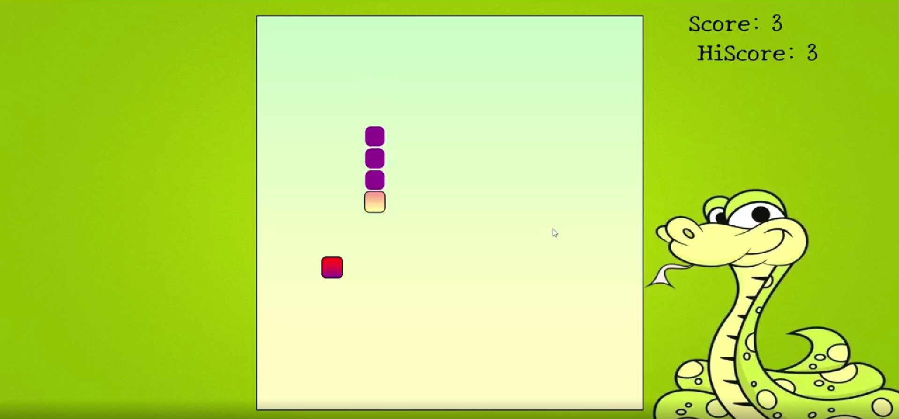

# SNAKEGAME

SNAKEGAME is a classic game built using HTML, CSS, and JavaScript.

## Features

- Smooth keyboard controls (Arrow keys)
- Score and high score tracking (stored in browser localStorage)
- Sound effects for movement, eating food, and game over
- Responsive design with custom background and styling

## How to Play

1. Open `index.html` in your web browser.
2. Use the **Arrow keys** to control the snake's direction.
3. Eat the food to grow longer and increase your score.
4. Avoid colliding with the walls or yourself.
5. Try to beat your high score!

## Project Structure

- **index.html**: Main HTML file.
- **css/style.css**: Game styling.
- **img/bg.jpg**: Background image.
- **js/index.js**: Game logic and controls.
- **music/**: Sound effects and background music.

## Credits

- Background image and music are for demonstration purposes.
- Developed as a fun project to learn JavaScript and DOM manipulation.

---
Enjoy playing SNAKEGAME!